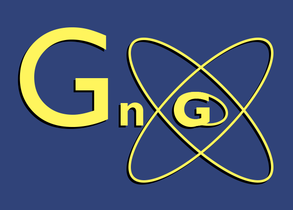
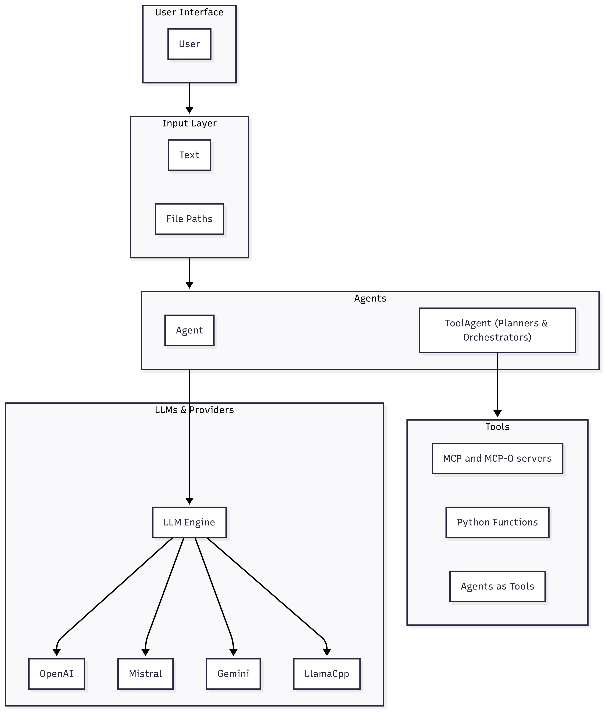

# Atomic-Agentic
<div align="center">

</div>

**Atomic-Agentic** is an agentic AI framework for professional developers and curious hobbyists who want to learn, prototype, and ship agent systems grounded in **SOLID** and **POSA (Pattern-Oriented Software Architecture)** principles—without vendor lock-in or framework magic.

At its core, Atomic-Agentic is **provider-agnostic**. Agents keep the **same input/output behavior** no matter which LLM you plug in—OpenAI, Gemini, Mistral, llama.cpp, and beyond. Engines are swappable; agent code stays the same. This separation of concerns lets you evaluate models, costs, and latency **without rewriting** your agent logic.

Atomic-Agentic also embraces modern **protocol ecosystems** out of the box. It supports **A2A** (Agent-to-Agent) and **MCP/MCP-O** so your agents can run as remote services or call into remote tool servers cleanly. The framework keeps this modular and encapsulated so you don’t have to hand-roll tool exposure and schemas for common cases.

### Core Agentic Patterns
<div align="center">
</div>

* **Agents & Role Prompts (aka System Prompts):**
  Define how an agent “thinks” and speaks through a clear role-prompt. Additionally, you can choose to enable conversation memory for stateful exchanges and conversations.

* **Tool-Using Agents:** Enable more complex behavior and expand the return types of agent output by enabling agents to invoke calls to contextualized methods or other agents. Access external tools via **MCP/MCP-O** with minimal glue. Atomic-Agentic follows two approaches to using tools.

  * **PlannerAgent:** Generate a single plan first, then execute all the steps in order.
  * **OrchestratorAgent:** Generate and execute a single step at a time, and use its results as context for creating the next step.

  These map naturally to classic OOP patterns: *Strategy* (choose execution approach per context) and *Template Method* (stable skeleton with tool calls as variable steps).

* **Remote agents:**
  Host agents as **A2A servers** or call them **remotely via agent proxy entrypoints** for distributed, multi-agent-systems.

## Who is this for

**Professional developers, students, and hobbyists.** Atomic-Agentic is conceptually accessible: it uses familiar SOLID/POSA ideas, explicit classes, and minimal magic so you can reason about behavior and change it safely.

**Multi-project, multi-provider teams.** If you maintain several AI projects with **different providers/environments** (OpenAI, Gemini, Mistral, llama.cpp, on-prem) but want to **reuse the same agent concepts and interfaces**, Atomic-Agentic lets you swap engines without rewriting agents, tools, or orchestration logic.

---

## Repository layout

**Top-level**

```
Atomic-Agentic/
├── modules/
├── examples/
├── atomic_ui.py
└── requirements.txt
```

**modules/** (ordered **most dependent → least**)

```
modules/
├── A2Agents.py       # A2A server/proxy wrappers; sits on top of tool/agent infrastructure
├── ToolAgents.py     # Tool-using agents: Planner/Orchestrator; depends on Agents/engines/plugins/prompts
├── Agents.py         # Core agent base (persona, optional memory, attachments); uses engines/prompts
├── LLMEngines.py     # Provider adapters (OpenAI, Gemini, Mistral, llama.cpp); small, stable contract
├── Plugins.py        # Plugin API + built-ins (math/console/etc.); light coupling
└── Prompts.py        # Prompt templates/constants; leaf dependency
```

**examples/** (subdirectories only; one-line purpose each)

```
examples/
├── Agent_Examples/          # Basic agent persona pattern (role prompt + optional memory)
├── A2A_Examples/            # Remote agents: run as A2A servers and call via proxies
├── Planner_Examples/        # PlannerAgent: plan-once-then-execute workflows
└── OrchestratorExamples/    # OrchestratorAgent: step-by-step, result-aware tool calling
```

---

## Installation & setup

```bash
# 1) Clone
git clone https://github.com/gearsngenes/Atomic-Agentic.git

# 2) Enter the project
cd Atomic-Agentic

# 3) Install dependencies (assumes your venv is already active)
pip install -r requirements.txt
```

**4) Configure provider credentials**
Export environment variables **or** create a `.env` at the repo root:

```bash
# Pick what you need
export OPENAI_API_KEY=...
export GOOGLE_API_KEY=...      # for Gemini
export MISTRAL_API_KEY=...
```

Or `.env`:

```
OPENAI_API_KEY=...
GOOGLE_API_KEY=...
MISTRAL_API_KEY=...
```

**5) Run something immediately**

```bash
# Streamlit UI
streamlit run atomic_ui.py

# OR an example (replace <script>.py with a real script in that folder)
python examples/Agent_Examples/<script>.py
python examples/Planner_Examples/<script>.py
python examples/OrchestratorExamples/<script>.py
python examples/A2A_Examples/<script>.py
```
